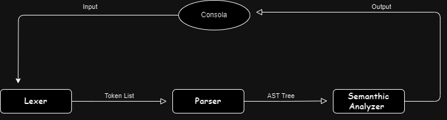
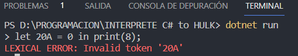
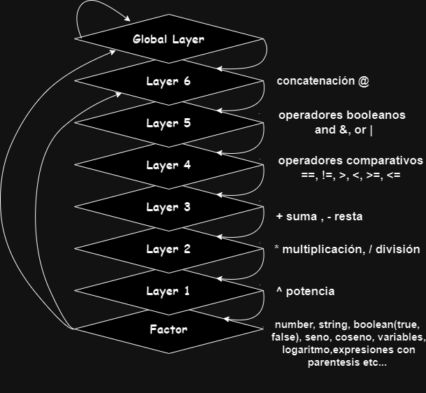
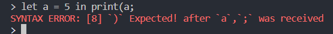
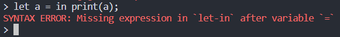
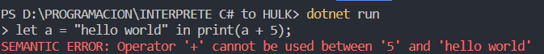
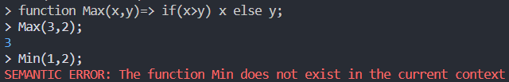
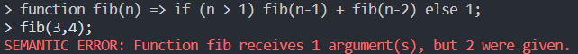

# HULK: Havana University Language for Kompilers

> II Proyecto de Programación.\
> Facultad de Matemática y Computación - Universidad de La Habana.\
> Cursos 2022 - 2023.\
> Arianne Camila Palancar Ochando C111


`HULK` es un lenguaje de programación imperativo, funcional, estática y fuertemente tipado. Casi todas las instrucciones en HULK son expresiones, en este caso comprendidas en una sola linea y siempre terminando con un punto y coma `';'`


## ¿Cómo funciona?
`Clase Program` : Controla el flujo de datos del Interprete.

### Diagrama del flujo de datos:



### [ Leyenda ]

1. **Consola (Console)**: Es la interfaz donde los usuarios interactúan con el programa, introduciendo la entrada y viendo la salida.

2. **Entrada (Input)**: Es el texto que recibe de la consola y se manda al lexer.

3. **Analizador Léxico (Lexer)**: Esta etapa toma la entrada de texto y la convierte en una lista de tokens.

4. **Lista de Tokens (Token List)**: Esta es la salida del Analizador Léxico. Es una lista de todos los tokens extraídos del código fuente y son enviados al Parser.

5. **Analizador Sintáctico (Parser)**: Esta etapa toma la lista de tokens y construye un Árbol de Sintaxis Abstracta (AST). 

6. **Árbol de Sintaxis Abstracta (AST Tree)**: Este es el resultado del Analizador Sintáctico. Representa la estructura del programa de una manera que es fácil de procesar para las siguiente etapa (Semantic Analyzer).

7. **Analizador Semántico (Semantic Analyzer)**: Esta etapa toma el AST y realiza varias comprobaciones para asegurarse de que el código tiene sentido desde el punto de vista semántico. Evalua las expresiones y ejecuta las operciones correspondientes

8. **Salida (Output)**: Finalmente, después de que todas las etapas anteriores se han completado con éxito, el intérprete produce una salida.


## **`Lexer`** (Analizador Lexico)
**`El Lexer`** se encarga del análisis léxico del lenguaje. Lee el texto de entrada y genera una secuencia de tokens que representan las unidades básicas del lenguaje. Cada token tiene un tipo que indica qué tipo de unidad léxica representa (por ejemplo, un número, una cadena, un identificador, un operador, etc).

La clase Lexer tiene un método llamado `Get_Sequency()`, que toma una cadena de texto como entrada y devuelve una lista de tokens. Este recorre la cadena de texto, uno por uno, y para cada caracter (mediante el resto de metodos de la clase) reconoce el tipo de token que le corresponde y lo guarda en la lista y el proceso continúa con el siguiente carácter en la cadena de texto.


#### _Acerca de los errores_:
Los posibles errores lexicos de un interprete son aquellos que se producen cuando en interprete no reconoce o no procesa correctamente los simbolos o las palabras que forman parte del lenguaje que esta interpretando.
Por ejemplo: 




## **`Parser`** (Analizador Sintactico)

**`El parser`** se encargara de analizar la lista de tokens recibidas del Lexer y establecer una estructura coherente para la formacion de expresiones, a través de un AST (Árbol de Sintaxis Abstracta), sobre el cual se hablara más adelante.

La clase Parser que toma una secuencia de tokens y construye un árbol de análisis sintáctico. El método `Global_Layer()` decide qué acción tomar en función del token actual. Si el token es “print”, “let”, “if” o “function”, se llama a los métodos correspondientes. Si no es ninguno de estos, se llama al método `Layer_6()`

- `Assigment()` : Este método se encarga de procesar las asignaciones de variables en el lenguaje. Primero, espera un token de tipo **VARIABLE** que será el nombre de la variable. Luego, espera un token de tipo **EQUAL** y después obtiene el valor que se le asignará a la variable llamando al método  `Layer_6()`. Este proceso se repite para cada asignación separada por comas. Finalmente, espera un token de tipo **IN** y obtiene las operaciones a realizar después de las asignaciones llamando al método `Global_Layer()`. Retorna un nodo de tipo _“Let”_ que contiene todas las asignaciones y las operaciones.
    ### Estructura
    `let` + **Variable** + **'='** + **Expresión o Valor** + `in` + **Expresión** + **;**

- `Showing()` : Este método se encarga de procesar las impresiones en el lenguaje. Espera un token de tipo **L_PHARENTESYS**, luego obtiene la expresión a imprimir llamando al método `Global_Layer()` y finalmente espera un token de tipo **R_PHARENTESYS**. Retorna un nodo de tipo _“print”_ que contiene la expresión a imprimir.
    ### Estructura
    `Print` + **'('** + **Expresión o valor'** + **')'** + **;**

- `Conditional()` : Este método se encarga de procesar las estructuras condicionales en el lenguaje. Primero, espera un token de tipo **L_PHARENTESYS** y luego obtiene la condición del condicional llamando al método `Layer_6()`. Después, espera un token de tipo **R_PHARENTESYS** y obtiene las operaciones a realizar si la condición es verdadera llamando al método `Global_Layer()`. Luego, espera un token de tipo **ELSE** y obtiene las operaciones a realizar si la condición es falsa llamando nuevamente al método `Global_Layer()`. Retorna un nodo de tipo _“Conditional”_ que contiene la condición y las operaciones a realizar si la condición es verdadera o falsa.
    ### Estructura
    `if` + **'('** + **condición (bool)** + **')'** + **Operación a realizar (si la condiciónn es Verdadera)** + `else` + **Operación a realizar (si la condición es falsa)** + **;**

- `Function()` : Este método se encarga de procesar las funciones en el lenguaje. Primero, espera un token de tipo **VARIABLE** que será el nombre de la función. Luego, espera un token de tipo **L_PHARENTESYS** y obtiene los nombres de los parámetros de la función. Después, espera un token de tipo **R_PHARENTESYS** y otro de tipo **DO**, y obtiene las operaciones a realizar en la función llamando al método `Global_Layer()`. Retorna un nodo de tipo _“Function”_ que contiene el nombre de la función, los parámetros y las operaciones a realizar en la función.
    ### Estructura
    `function` + **'variable** + **'('** + **parametros de la funcion separados por coma**+**')'** + `=>` + **Operación a realizar** + **;**


Estos métodos implementan la precedencia de operadores en tu lenguaje. Cada método **Layer_i** se encarga de una precedencia específica. Los operadores con mayor precedencia son procesados en métodos **Layer_i** con **i** más grande. Por ejemplo, `Layer_2()` se encarga de los operadores de multiplicación, división y módulo, que tienen mayor precedencia que los operadores de suma y resta manejados por `Layer_3()`. Cada método obtiene un nodo inicial y luego, mientras el token actual es uno de los operadores que maneja, crea nuevos nodos con esos operadores y los nodos obtenidos anteriormente.




`Factor` se encarga de procesar los factores en el lenguaje. Un factor puede ser una expresión entre paréntesis, un número, un valor booleano (true o false), una cadena, una variable, una función declarada o una función trigonométrica (coseno o seno). Cada caso se maneja por separado.

Estos métodos auxiliares se utilizan para manejar los errores en el analizador sintáctico. El método `Input_Error()` lanza una excepción con un mensaje de error. El método `Exceptions_Missing()` verifica si un nodo es de tipo _“error”_ y lanza una excepción en ese caso. El método `Expect()` verifica si el token actual es del tipo esperado y avanza a la siguiente posición en ese caso, o lanza una excepción si no lo es.

#### _Acerca de los errores_:
Los errores sintacticos de un interprete son aquellos que se producen cuando el código fuente de un programa no respeta las reglas gramaticales del lenguaje que esta interpretando.

**- Errores de puntuacion:** Se producen cuando el interprete no encuentra algun signo de puntuacion requerido por la gramatica de alguna expresión, o por el contrario encuentra más de los que deberían.



**- Errores de estructura:** Se producen cuando el interprete no reconoce la forma o el orden de los elementos que componen las instrucciones.




## **`Semantic Analyzer`** (Analizador Semántico)

`El analizador semántico` utilizara el **AST** y los símbolos correspondientes para comprobar si el programa cumple con las reglas semanticas del lenguaje.

La clase Semantic_Analyzer se encarga del análisis semántico del lenguaje. Lee el **Árbol de Análisis Sintáctico Abstracto (AST)** generado por el **Parser** y realiza acciones en función del tipo de cada nodo. Las acciones pueden incluir la evaluación de nodos y la impresión de resultados.

El método `Evaluate()` se encarga de evaluar un nodo en función de su tipo. Para cada tipo de nodo, realiza una operación específica. Por ejemplo, si el nodo es un número o una cadena, simplemente retorna su valor;si el nodo es una variable, busca su valor en el ámbito actual; si el nodo es una operación aritmética o booleana, evalúa los nodos hijos y realiza la operación correspondiente; si el nodo es una función coseno o seno, evalúa el nodo hijo y retorna el coseno o seno del resultado; si el nodo es un condicional, evalúa la condición y retorna la evaluación del primer o segundo nodo hijo dependiendo de si la condición es verdadera o falsa; si el nodo es una función, crea una nueva función y la añade a la lista de funciones declaradas. Y así sucesivamente para cada tipo de nodo.

El método `Get_Var_Param()` se encarga de crear un diccionario para almacenar los parámetros de una función. 

El método `Save_Var()` se encarga de guardar las variables del Let en el ámbito actual. Para cada asignación en la lista de asignaciones, evalúa el valor y añade la variable al ámbito actual. Si la variable ya existe en el ámbito actual, actualiza su valor. Si el nombre de la variable coincide con el nombre de una función existente, lanza una excepción

El método `Call_Function()` se encarga de llamar a una función en el lenguaje. Busca la función en la lista de funciones declaradas y verifica que el número de parámetros coincida. Luego, añade todas las variables del ámbito anterior al ámbito actual y actualiza los valores de los parámetros en el ámbito actual. Si la función no se encuentra o el número de parámetros no coincide, lanza una excepción.

Entre otros métodos auxiliares está el método `Function_Exist()` que verifica si una función existe en la lista de funciones declaradas; el método `Input_Error()` que lanza una excepción con un mensaje de error; el método `Type_Expected()` verifica si dos valores son del tipo esperado y lanza una excepción si no lo son y el método `Expected()` verifica si un valor es del tipo esperado y lanza una excepción si no lo es.

#### _Acerca de los errores_:
Los errores semánticos del interprete son aquellos que se lanzan cuando el codigo fuente de un programa cumple con la sintaxis correcta, pero no cumple con el significado de la logica del lenguaje que esta interpretando.

**- Errores de tipo:** Se produce cuando no se respeta las reglas de compatibilidad, por ejemplo: comparar un string y un number, sumar un string y un number etc.



**- Errores de nombres:** Se produce cuando el interprete no encuentra o no distingue los nombres que se usan para referirse a las variables, funciones etc.


> Se ha definido la función Max() y se puede usar, al intentar llamar una función no declarada como Min() en este caso, da esta clase de error, pues no se encuentra su definición.

**- Errores de funciones:** Se produce cuando no se respeta las reglas de definicion, la cantidad de parametros y de invocación.


> La definicion de la funcion es correcta, sin embargo a la hora de llamar a la función la cantidad de parametros es incorrecta.

## **`Clase Token`**
Se utiliza para representar los Tokens en el interprete. Cada instancia de la clase representa un único token y almacena información relevante del mismo, como su Tipo (TokenType) y su valor.

### Tipos de tokens
```
- TIPO DE DATOS
    - NUMBER,
    - STRING,
    - BOOLEAN,

- OPERADORES
    - OPERATOR,
    - EQUAL,
    - DO,

- PUNTUADORES
    - L_PHARENTESYS,
    - R_PHARENTESYS,
    - PRINT,
    - COMMA,
    - D_COMMA,
    - COMMILLAS,

- Own Words
    - LET,
    - IN,
    - IF,
    - ELSE,
    - TRUE,
    - FALSE,
    - FUNCTION,

-  Reserved Word
    - COS,
    - SEN,
    - LOG,
- Other
    - VARIABLE,
    - EOF
```

## **`Clase Node`**
Se utiliza para representar los Nodos en la representacion de un arbol. Cada instancia de la clase representa un único nodo y almacena información relevante del mismo, como su Tipo (Type), su valor (Value) y su lista de hijos (Childrens)

## **¿Qué es un `AST`?**
El árbol de sintaxis abstracta (AST), o simplemente un árbol de sintaxis es una representación de árbol de la estructura sintáctica simplificada del código fuente escrito en cierto lenguaje de programación. Cada nodo del árbol denota una construcción que ocurre en el código fuente. La sintaxis es abstracta en el sentido que no representa cada detalle que aparezca en la sintaxis verdadera. Por ejemplo, el agrupamiento de los paréntesis está implícito en la estructura del árbol.

## **¿Cómo usarlo?**
Pues bien, ya entendida la teoría del funcionamiento de este interprete, vamos a la parte práctica, **¿Cómo usarlo?**.

Por ahora es una aplicación de consola, por tanto debe:
1) Abrir la carpeta donde se encuentra el proyecto
2) Abrir Terminal / Consola y escribir el siguiente comando:
```
dotnet run
```
3) Aqui ya puede empezar a escribir el codigo del Hulk

### Un pequeño resumen de lo que puedes hacer
- Imprimir en pantalla un texto o expresión
- Hacer operaciones aritmeticas como: suma `'+'` , resta `'-'`, multplicacion `'*'`, división `'/'`, potenciación `'^'`, operaciones con espresiones booleanas `'&', '|'`, comparación`'==', '>=', '<=', '>', '<'`, concatenar strings `'@'`.
- Hacer operaciones matematicas sencillas. Por ahora estan definidas: `seno (sin), coseno (cos), logaritmo(log)`.
- Definir funciones respetando la estructura que se ha mostrado antes.
- Definir variables respetando la estructura que se ha mostrado antes de igual forma
- Usar condicionales `if-else` asimismo como en casos anteriores, respetando su estructura.

### Herramientas para la realización de este informe:
----
- Markdown
- https://app.diagrams.net/ (para elaborar los diagramas)
